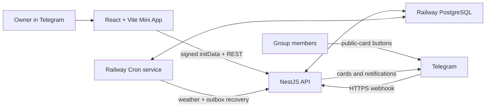

# Telegram Mini App Migration Plan

> Implementation handoff for the agent rebuilding the project. This document describes the target system; the current SQLite/long-polling bot remains the legacy implementation until the migration is complete.

## 1. Goal

Replace the private-chat command interface with an owner-only Telegram Mini App. The owner manages matches, roster corrections, external participants, and player names in the Mini App. Group members continue to vote from the public Telegram match card.

The result is a pnpm-workspace monorepo with a NestJS backend, a React + Vite frontend, PostgreSQL on Railway, and a Telegram webhook. Both frontend and backend use strict TypeScript.

## 2. Locked product and architecture decisions

| Area | Decision |
| --- | --- |
| Administration | Exactly one configured Telegram owner can use the Mini App. Every HTTP mutation is authorized by that owner ID on the server. |
| Scope | Exactly one configured Telegram group and its configured `General` and `Chat` topics per environment. There is no group selector or multi-tenant model. |
| Participant voting | Members vote through buttons on the public match card. Their button presses are handled through a Telegram webhook. |
| Bot conversations | Remove private command flows, private draft/admin panels, `/start` dependency, and private external-player menus. The bot is an adapter for public-card voting and group notifications only. |
| External participants | The owner manages external-participant entries in the Mini App. Remove the current participant self-service `Доп. игроки` flow that opens a private bot conversation. |
| Match input | Use structured form fields and server validation. Remove natural-language parsing, OpenRouter, and the `openai` dependency completely. |
| Backend | NestJS, grammY in webhook mode, PostgreSQL, Drizzle ORM, Railway persistent API service. Do not use `bot.start()` or long polling. |
| Scheduled work | A separate Railway Cron service runs short, idempotent jobs and exits. Do not use `setInterval`, `node-cron`, or an in-process Nest scheduler as the source of truth. |
| Frontend | React + Vite, TanStack Query, shadcn/ui, Framer Motion, Telegram Mini App APIs. Deploy as a separate HTTPS static web service; the initial default is a Railway web service. |
| API contracts | Nest Swagger/OpenAPI DTOs are the single REST-contract source. Orval generates TypeScript types and TanStack Query hooks into `packages/api-client`. Do not maintain duplicate HTTP DTOs by hand. |
| Database | Start from an empty PostgreSQL database. There is no SQLite data migration, but there must be a versioned PostgreSQL baseline migration. |
| Environments | Test and production are fully isolated: Railway environment, PostgreSQL database, bot token, webhook secret, owner/group/topic IDs, Mini App URL, and web deployment. |

## 3. Product behavior to preserve

Keep these business rules while replacing the interfaces and persistence layer:

- Lifecycle: `draft -> active -> confirmed -> completed` and `active|confirmed -> cancelled`.
- `requiredPlayers` is a threshold, not a roster capacity. Votes and owner-managed external participants remain editable in `active` and `confirmed` states.
- Reaching and losing the threshold creates the existing group-topic notifications; a later upward crossing can notify again.
- Confirming and cancelling create their existing `Chat` topic notifications. Completion/cancellation removes the public card but retains match history.
- Outdoor, exact-time active/confirmed matches receive at most one Minsk weather forecast per calendar day around the existing 16-hour lead window. Indoor matches do not.
- Card rendering remains the source of truth, uses HTML escaping and Telegram length limits, and refreshes after every relevant change.
- `General` topic ID `1` is sent without `message_thread_id`, matching Telegram's special representation of the General topic.

The following legacy behavior is intentionally removed: creator-specific private authorization, group-admin checks for private commands, startup/shutdown direct messages, natural-language match parsing, `drop_pending_updates` long-polling behavior, and user-operated private external-player menus.

## 4. Target layout

```text
apps/
  api/                         NestJS API, Telegram webhook, jobs
  web/                         React + Vite Telegram Mini App
packages/
  domain/                      Pure rules, value objects, card formatter
  db/                          Drizzle PostgreSQL schema, migrations, repositories
  api-client/                  Generated OpenAPI types and React Query hooks
docs/
  mini-app-implementation-plan.md
```

Use package names such as `@football/api`, `@football/web`, `@football/domain`, `@football/db`, and `@football/api-client`. Configure `pnpm-workspace.yaml` with `apps/*` and `packages/*`. Keep the root package private and use root scripts only to orchestrate workspace scripts; Turborepo is not required for the first version.

`packages/domain` must not import Nest, Drizzle, Telegram, browser APIs, or generated OpenAPI code. `packages/db` is backend-only. `packages/api-client` is generated output and must never be edited manually.



## 5. Security and identity model

### Mini App requests

1. The Vite app reads the raw `window.Telegram.WebApp.initData` string.
2. The Orval custom fetcher sends it in `X-Telegram-Init-Data` on every `/v1` request, together with an `Idempotency-Key` for mutations.
3. A Nest guard validates the Telegram HMAC, validates `auth_date` freshness, and requires `user.id === TELEGRAM_OWNER_USER_ID`.
4. The guard rejects every request that fails validation. Never trust `initDataUnsafe` for identity or authorization, and never log raw `initData`.

Use a configurable maximum init-data age with a safe default of 24 hours. If it expires, the UI tells the owner to reopen the Mini App. For local development, use a script that generates correctly signed fixture `initData` with a test bot token; do not add a production authentication bypass.

Only `GET /health`, the Telegram webhook, and the Cron entrypoint bypass the Mini App guard. CORS must allow only the exact `WEB_ORIGIN` for the current environment and the required headers; do not use `*`.

### Telegram updates

- Expose `POST /telegram/webhook` only.
- Verify `X-Telegram-Bot-Api-Secret-Token` before dispatching the update to grammY.
- Register the stable HTTPS URL with `setWebhook`, a secret token, and only the update types actually used (initially `callback_query`).
- Do not call `bot.start()`, `bot.catch()` as a background loop, or any long-polling API.
- Claim `update_id` and apply the corresponding business change in one PostgreSQL transaction. A duplicate update returns `2xx` without reapplying the action.
- Validate that every callback is from the stored public-card message in the configured group/topic before accepting a vote. A callback payload is never sufficient authorization on its own.
- Return `2xx` only after the database transaction commits. Acknowledge the callback separately after the commit; failure to acknowledge must not replay the business action.

## 6. PostgreSQL design and concurrency rules

Create one clean, versioned PostgreSQL baseline migration under `packages/db`. Do not run migrations automatically when Nest starts. Run the migration as the Railway pre-deploy/release step.

Use PostgreSQL `timestamptz` for instants. Store Telegram user IDs, chat IDs, topic IDs, and update IDs as PostgreSQL `bigint`; serialize them as decimal strings at the REST boundary so JavaScript never loses precision. Preserve a small numeric public match identifier (`#v<ID>`) with a `bigint generated ... as identity` match ID, also serialized as a string in JSON.

The baseline schema must include these concepts:

| Table/concept | Required purpose and invariants |
| --- | --- |
| `matches` | Structured schedule/location/venue/price/threshold/status/cancellation data, `version` or equivalent optimistic-concurrency field, and timestamps. |
| `match_messages` | One public-card reference per match: Telegram chat, topic, and message IDs. Private admin panels are not migrated. |
| `players` | A canonical player profile with nullable unique `telegram_user_id`, optional owner-defined `display_name`, and Telegram profile snapshots. |
| `player_usernames` | Normalized username to player mapping. It lets the owner create `@username -> readable name` before a vote and supports later username changes. |
| `votes` | One current choice per `(match_id, player_id)`, raw Telegram identity snapshots, option, source, and timestamp. An owner may correct/remove a known player's vote; an unresolved username cannot be used to fabricate a Telegram vote. |
| `external_participants` | Owner-managed named or unnamed quantity entries for a match. Their total counts toward the threshold. |
| `telegram_updates` | Globally unique Telegram `update_id` claims for webhook idempotency. |
| `http_idempotency_keys` | Owner + idempotency-key + request hash, stored result/status, and expiry. Reusing a key with a different request returns a conflict. |
| `notifications` | Durable threshold, lifecycle, and daily-weather idempotency records. |
| `outbox` | Post-commit Telegram effects such as card refreshes, card deletion, and notifications, with deduplication keys, attempts, and delivery state. |
| `job_claims` or PostgreSQL advisory locks | Protection against overlapping Cron executions. |

Player resolution is deliberately two-stage:

1. The owner may create a player by entering `@username` and a readable display name before that person has voted. The profile is shown as **unconfirmed** because it has no Telegram ID.
2. On the first Telegram update, resolve by immutable Telegram user ID first; if unknown, resolve the normalized username mapping and atomically bind that ID. Update the username mapping when Telegram reports a new username.

Define and test conflict rules before coding: one Telegram ID may bind to only one player; a username cannot silently move from a different bound player; a user without a username can be renamed after their first vote from the Mini App. Usernames are lookup metadata, never an authorization identity. Render the current readable name in active cards and history, while retaining raw Telegram snapshots for auditability.

All vote, lifecycle, external-participant, alias-binding, and notification-transition changes must use a transaction, unique constraints, and conditional updates/row locks where appropriate. Webhook voting and owner actions may arrive at the same time.

Every Mini App mutation requires an `Idempotency-Key`. Use `If-Match`/the match `version` for editing a stale match form, returning a conflict that the UI can reload rather than overwriting data.

### Telegram side effects

Persist business state and an outbox event in the same transaction. After commit, make a bounded best-effort attempt to dispatch the event; the Cron service recovers pending events. Refresh events should read the latest database state, so repeated card edits converge to the same rendering.

Telegram has no idempotency key for the initial `sendMessage` call. Treat a crash after a successful send but before saving its message ID as an **uncertain publication**, not as permission to silently send duplicates. Persist a publication state, surface a repair action in the Mini App, and document its operator procedure. Existing-card edits and deletes can be retried safely with the stored reference.

## 7. REST/OpenAPI and Orval

Build REST operations around user actions rather than generic database CRUD. At minimum, provide operations for:

- bootstrapping the owner UI and listing draft/active/confirmed/history matches;
- creating a structured draft, editing it, rendering a preview, publishing it, confirming it, completing it, and cancelling it with a reason;
- loading a match roster, correcting/removing a known player's vote, and creating/updating/removing owner-managed external-participant entries;
- searching players, creating/editing/removing aliases, and exposing confirmation/binding state;
- refreshing/reconciling a public card when an operator action is required.

All server input is validated with Nest DTOs and runtime validation. The backend is the source of truth for title derivation, card preview, timezone (`Europe/Minsk`), lifecycle validation, and authorization. Do not rely on browser-only form validation.

Use Nest Swagger decorators with stable `operationId` values and a documented `telegramMiniApp` security scheme. Exclude `/telegram/webhook`, health, and Cron endpoints from the generated public client.

Generate `openapi.json` from the Nest application without binding a production port, then run Orval in `packages/api-client` in React Query `tags-split` mode. Configure its custom mutator to add the current raw init data, idempotency key, error normalization, and API base URL. Add scripts equivalent to:

```text
pnpm --filter @football/api openapi:write
pnpm --filter @football/api-client generate
pnpm api:contracts:check
```

The contract-check script regenerates the specification/client and fails when the checked-in generated output differs. CI must run it before frontend build.

## 8. Frontend handoff

Implement the Mini App in `apps/web` with strict TypeScript, React, Vite, TanStack Query, shadcn/ui, and Framer Motion. Use a small typed adapter for Telegram WebApp APIs that calls `ready()`, handles theme and safe-area variables, and displays a useful fail-closed state outside Telegram or after an authorization failure. Do not retry 401/403 responses indefinitely.

Use the following information architecture:

| Screen | Required capabilities |
| --- | --- |
| `Matches` dashboard | Active/draft/confirmed cards, roster progress, status, quick actions, and clear state when there are no matches. |
| Create/edit match | Structured fields for date, time, location, venue type, threshold, and optional price; validation; draft saving; public-card preview before publication. |
| Match detail | Attendance grouped by vote, owner vote correction/removal, external-participant management, lifecycle actions, card-refresh status, and cancellation reason. |
| Players | Searchable player list; create an alias by `@username` without a prior vote; edit readable names; visibly mark unconfirmed aliases and resolved Telegram identities. |
| History | Completed and cancelled matches, final roster/state, and cancellation reason. |

The public-card preview must use the same backend/domain formatter as actual Telegram publication; do not maintain a separately copied frontend template.

The visual direction is compact, dark, Telegram-native, and mobile-first: `Matches`, `Players`, and `History` are the primary bottom tabs; blue is the primary action color; green communicates fulfilled roster/state rather than being the default action; red is reserved for cancellation/destructive actions. Use shadcn primitives for accessible controls and Framer Motion only for restrained screen/card transitions. Use initials or available Telegram profile data in the real UI, not synthetic profile photos.

The visual concept has been explored but its image assets are not committed to the repository. Before pixel-level frontend implementation, obtain the owner's approval for the design direction or a supplied design reference. The functional screen contract above is already approved.

## 9. Railway topology and configuration

Create separate services in each Railway environment:

1. **API service** — persistent NestJS process, listening on `0.0.0.0:$PORT`, with health checks and graceful shutdown.
2. **PostgreSQL service** — Railway-managed database connected through `DATABASE_URL`.
3. **Cron service** — same codebase, running a short `jobs:run` command every five minutes or another validated schedule. It acquires a database lock, drains retryable outbox work, runs due weather work, then exits.
4. **Web service** — Vite static production build exposed at an HTTPS URL. Keep `VITE_API_BASE_URL` public and build-time only; never put bot credentials in Vite variables.

Required API-side configuration is expected to include:

```text
DATABASE_URL
TELEGRAM_BOT_TOKEN
TELEGRAM_WEBHOOK_SECRET
TELEGRAM_OWNER_USER_ID
TELEGRAM_GROUP_CHAT_ID
TELEGRAM_GENERAL_TOPIC_ID
TELEGRAM_CHAT_TOPIC_ID
TELEGRAM_MINI_APP_URL
WEB_ORIGIN
GROUP_TIMEZONE=Europe/Minsk
LOG_LEVEL
```

Validate all values at startup, log variable names rather than secret values, and remove `OPENROUTER_API_KEY`, `OPENROUTER_MODEL`, `TELEGRAM_STATUS_USER_ID`, and `CONFIRM_MATCH_CREATION` from the new configuration.

For each test and production environment, provision independent values for every item above. Set the webhook only after the target API has a stable HTTPS domain; set the Mini App URL and menu/Main Mini App in BotFather for that environment. The owner opens the app from the bot's Mini App entry point, not through a private command flow.

## 10. Implementation sequence

Do not attempt a partial production cutover. Complete each phase with its checks before moving on.

### Phase 0 — Confirm scope and prepare the branch

- Confirm the explicit removal of the private `Доп. игроки` flow and any remaining private bot messages.
- Confirm the visual direction before fine-grained frontend styling.
- Record the test group, production group, owner IDs, topic IDs, and deployment domains outside the repository.
- Preserve the existing dirty worktree; do not reset or overwrite unrelated user changes.

**Exit criterion:** the decisions in sections 2 and 8 are accepted and no legacy data needs exporting.

### Phase 1 — Scaffold the monorepo and quality gates

- Convert the root to pnpm workspaces and add `apps/*` and `packages/*`.
- Create strict TypeScript configurations and package scripts for lint, test, typecheck, build, database migrations, OpenAPI generation, and generated-client verification.
- Set Node's engine to a version supported by the chosen Orval release (at least Node `22.18.0`; Node 24 LTS is preferred when available in Railway).
- Add a local PostgreSQL development/test path (Docker Compose or Testcontainers) without adding a SQLite fallback.

**Exit criterion:** an empty workspace installs with pnpm and `lint`, `typecheck`, and package builds run from the root.

### Phase 2 — Rebuild the domain and PostgreSQL persistence

- Move reusable lifecycle, roster-count, card-formatting, weather-formatting, and validation rules into `packages/domain` with no adapter imports.
- Implement the PostgreSQL Drizzle schema, baseline migration, async repositories, transactions, locking/idempotency, outbox, and player late-binding model.
- Port tests as PostgreSQL integration tests; do not wrap the synchronous SQLite repositories.
- Add a migration command that executes independently from API startup.

**Exit criterion:** a fresh PostgreSQL database migrates cleanly; concurrent vote/idempotency/alias tests pass; no application package imports `better-sqlite3`.

### Phase 3 — Build the NestJS API, webhook, and jobs

- Implement configuration validation, health endpoint, Mini App guard, CORS, structured match/player operations, and Swagger generation.
- Wire grammY to the webhook controller and remove long polling.
- Implement callback validation, update deduplication, public-card rendering, notification/outbox dispatch, and repair/reconciliation states.
- Implement the short-run Cron command with a database lock for outbox recovery and weather work.
- Add a script/runbook to register or update the webhook with its secret after deployment.

**Exit criterion:** mocked Telegram webhook tests prove duplicate callback safety, bad webhook-secret rejection, source-card validation, and no use of `bot.start()` or `setInterval`.

### Phase 4 — Generate contracts and build the Mini App

- Generate the OpenAPI file from Nest, configure Orval, and make generated code reproducible in CI.
- Implement the custom client/fetcher and TanStack Query invalidation strategy.
- Build the five screens in section 8, including preview-before-publish, stale-edit conflict handling, idempotent mutations, owner-only error states, and Telegram theme/safe-area support.
- Add component tests for loading, empty, validation, mutation-error, conflict, and unauthorized states.

**Exit criterion:** the frontend builds using only generated API types/hooks; no handwritten duplicate REST types exist.

### Phase 5 — Deploy test, accept, and cut over

- Deploy API, Postgres, Cron, and Web services in the test Railway environment.
- Apply the baseline migration, configure the test webhook and Mini App URL, and run the manual test matrix below in the test group.
- Repeat provisioning for production with separate secrets and database. Register the production webhook only when production is accepted.
- Remove obsolete SQLite source, migrations, dependencies, scripts, parser/OpenRouter code, private-command handlers, and legacy tests in one final coherent change. Rewrite the root README and legacy documentation to describe the Mini App architecture.

**Exit criterion:** production is running the new stack, the current SQLite database is no longer referenced, and all maintained docs describe the new system.

## 11. Required automated and manual acceptance checks

Automated checks must cover at least:

- valid, malformed, expired, and non-owner Telegram Mini App `initData`;
- a pre-created `@username` alias binding exactly once on first vote, username changes, no-username users, and conflicting bindings;
- webhook secret validation, `update_id` replay, fake/out-of-scope callback sources, and concurrent vote actions;
- one vote per player/match, threshold-up/down transitions, lifecycle rules, external participant changes, completion/cancellation card removal, HTML escaping, and card length limits;
- HTTP idempotency-key replay and stale match-version conflict;
- one weather notification per Minsk day despite repeated/overlapping Cron runs;
- outbox retry/reconciliation behavior, including the uncertain-initial-publication path;
- OpenAPI/Orval generated-output drift;
- real PostgreSQL repository integration tests, plus frontend component tests.

Run the root equivalent of `pnpm lint`, `pnpm test`, `pnpm typecheck`, `pnpm build`, and `pnpm api:contracts:check` in CI.

Manual test in the Telegram test group:

1. Open the Mini App as the owner, create a structured draft, inspect its public-card preview, and publish exactly one card in `General`.
2. Verify that a group member can choose each vote option and the card refreshes without a private chat interaction.
3. Rename a known player and create an alias for a never-seen `@username`; verify the latter is labelled unconfirmed and binds on that person's first vote.
4. Correct/remove a vote and manage external participants from the Mini App; verify threshold notifications and roster counts.
5. Confirm, complete, and cancel suitable matches; verify public-card deletion and retained history.
6. Trigger the weather job with a controlled clock/match and verify idempotency across repeated runs.
7. Attempt access from a non-owner account, an expired Mini App session, and a browser outside Telegram; all must fail closed.
8. Verify test and production use different bot/webhook/database identities before production cutover.

## 12. Explicit non-goals for this migration

- Migrating existing SQLite records or native poll records.
- Supporting multiple groups, multiple owners, or participant access to administrative REST operations.
- Reintroducing an LLM/natural-language match parser.
- Running the bot as a permanent long-polling process or relying on in-process scheduling.
- Sending participant-management flows into private bot dialogs.
- Hand-maintaining a second copy of HTTP contracts outside Nest Swagger/OpenAPI and Orval output.
